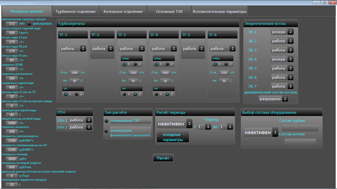
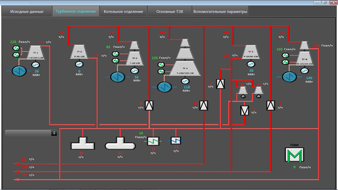
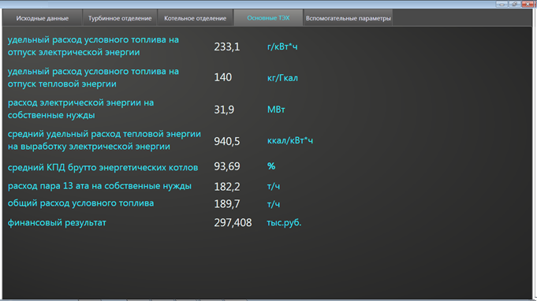
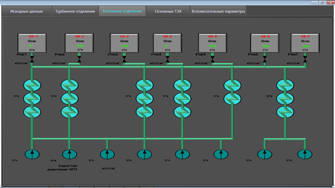
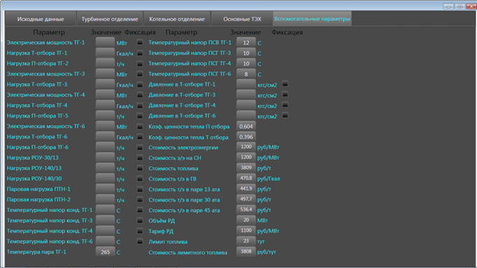

# Power-plant-modeling-and-optimization
The digital model of a power plant with an optimization function 

This prototype was developed during my scientific project in Kazan State Power Engineering University. Prototype is devoted to short-time and long-time optimal planning of work of power plant. You can look at the video-review following the link to my LinkedIn page account: https://www.linkedin.com/feed/update/urn:li:activity:6391261880182280192.
The prototype developed using C# programming language in the Visual Studio environment.

